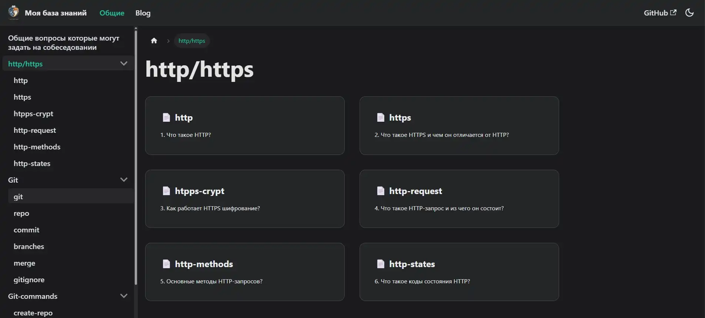

# <a href="https://maxim-belyi.github.io/MyDocs/"> My Knowledge Base </a>

Личный проект для систематизации знаний и заметок по веб-разработке и другим технологиям. Сайт построен с помощью [Docusaurus](https://docusaurus.io/).




## 🚀 О проекте

Проект появился из необходимости иметь удобно структурированное место для хранения информации которую я изучаю, а писать в заметки как-то не солидно.

## 🛠️ Стек технологий


## ⚙️ Как запустить локально

Чтобы развернуть этот проект у себя выполните следующие шаги

### Необходимые компоненты
*   [Node.js](https://nodejs.org/en/) (версия 18.0 или выше)
*   [npm](https://www.npmjs.com/) или [Yarn](https://yarnpkg.com/)

### Установка и запуск

1.  **Клонируйте репозиторий:**
    ```sh
    git clone https://github.com/Maxim-Belyi/MyDocs.git
    ```

2.  **Перейдите в папку проекта:**
    ```sh
    cd MyDocs
    ```

3.  **Установите зависимости:**
    ```sh
    npm install
    ```

4.  **Запустите сервер для разработки:**
    ```sh
    npm run start
    ```

После этого сайт будет доступен в браузере по адресу `http://localhost:3000`

## 📝 Как добавлять новый контент

*   **Новые статьи:** Создайте новый `.md` файл в папке `/docs`. Структура бокового меню генерируется автоматически на основе файловой структуры в этой папке.
*   **Изображения:** Храните все изображения в папке `/static/img` и ссылайтесь на них в Markdown, используя путь `/img/your-image.png`.
*   **Главная навигация:** Редактируется в файле `docusaurus.config.js` в секции `themeConfig.navbar`.
*   **Стили:** Глобальные стили можно переопределить или добавить в файле `/src/css/custom.css`.

## 🌐 Публикация на GitHub Pages

Проект настроен для автоматической публикации на GitHub Pages.

1.  **Настройте `docusaurus.config.js`:**
    Убедитесь, что поля `url`, `baseUrl`, `organizationName` и `projectName` заполнены правильно.

2.  **Выполните команду для деплоя:**
    ```sh
    npm run deploy
    ```
    Эта команда соберёт статические файлы сайта и запушит их в ветку `gh-pages` вашего репозитория.

3.  **Настройте репозиторий на GitHub:**
    В настройках репозитория (`Settings` -> `Pages`) выберите ветку `gh-pages` в качестве источника для публикации.

---