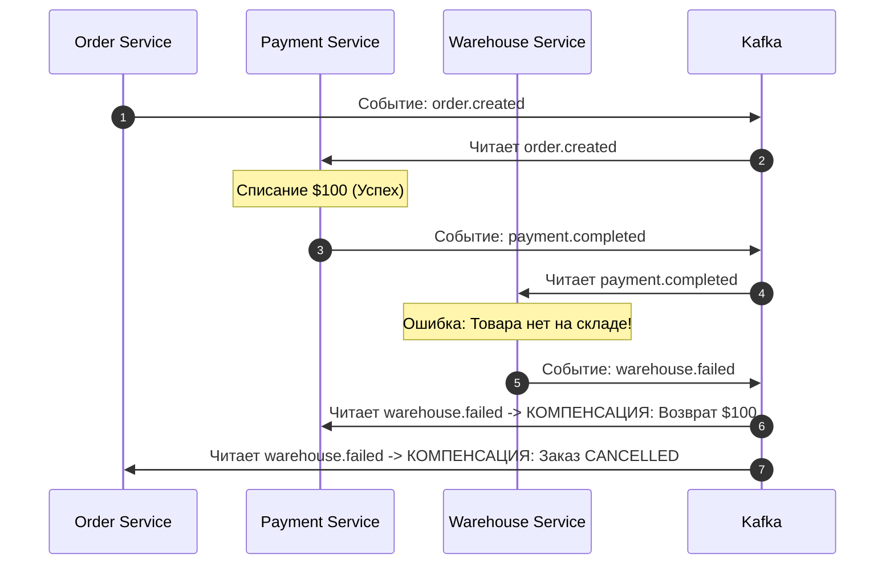

# Саги (Saga Pattern) и Идемпотентность API

В монолитном приложении все изменения в базе данных происходят внутри одной ACID-транзакции PostgreSQL (`BEGIN ... COMMIT`). Но когда система разбивается на независимые микросервисы (`Order Service`, `Payment Service`, `Warehouse Service`), каждый из которых владеет собственной изолированной базой данных, классические ACID-транзакции перестают работать.

В этой статье разберем, как гарантировать консистентность в распределенных системах через **паттерн Сага (Saga)**, чем **Хореография (Choreography)** отличается от **Оркестрации (Orchestration)**, и почему **идемпотентность HTTP/gRPC API** является фундаментом для любых компенсирующих транзакций.

---

## 1. Проблема консистентности микросервисов

Представьте бизнес-цепочку покупки товара:
1. `Order Service` создает заказ в статусе `PENDING` (в своей базе PostgreSQL).
2. `Payment Service` списывает $100 с банковской карты (через сторонний платежный шлюз).
3. `Warehouse Service` резервирует товар на складе (в своей базе MongoDB).

```
[Order Service: Заказ создан] ──> [Payment Service: Списано $100] ──> [Warehouse Service: ТОВАРА НЕТ!]
                                                                             │
                                                                             ▼ (Как вернуть $100?!)
```

### Что происходит при сбое на последнем шаге?
Если на шаге 3 выясняется, что товар на складе закончился (или сервис склада недоступен), мы **не можем просто сделать `ROLLBACK` SQL-транзакции**, потому что транзакции в сервисах `Order` и `Payment` уже закоммичены, а деньги с банковской карты клиента реально ушли.

Для решения этой задачи используется архитектурный паттерн **Сага (Saga Pattern)**.

---

## 2. Паттерн Сага: Оркестрация против Хореографии

**Сага** — это последовательность локальных транзакций в каждом сервисе. Если одна из локальных транзакций завершается с ошибкой, Сага запускает **компенсирующие транзакции (Compensating Transactions)** в обратном порядке, чтобы отменить изменения, сделанные на предыдущих шагах.

### Способ 1: Хореография (Choreography через брокер сообщений)
При Хореографии нет центрального управляющего сервиса. Каждый микросервис выполняет свою транзакцию, публикует событие в `RabbitMQ / Kafka` (`order.created`, `payment.completed`) и подписывается на события от других сервисов.



* **Плюсы:** Простая реализация при 2–3 шагах, слабая связность сервисов.
* **Минусы:** При 5+ шагах архитектура превращается в **«Event Hell (Ад событий)»**: логику Саги невозможно отследить из кода одного сервиса, появляются циклические зависимости и сложные состояния гонки между событиями компенсаций.

### Способ 2: Оркестрация (Orchestration — Стандарт для сложных бизнес-цепочек)
При Оркестрации создается отдельный сервис или координатор (**Saga Orchestrator** — например, на Go с использованием `Temporal` / `Cadence` или собственного State Machine в БД), который синхронно (через gRPC) или асинхронно управляет каждым шагом и явно вызывает команды отката.

```mermaid
graph TD
    Orch[Saga Orchestrator / Cadence / Temporal]
    
    Orch -->|1. gRPC: CreateOrder| O[Order Service]
    Orch -->|2. gRPC: ChargeMoney| P[Payment Service]
    Orch -->|3. gRPC: ReserveItem (ОШИБКА!)| W[Warehouse Service]
    
    Orch ==>|4. КОМПЕНСАЦИЯ: RefundMoney| P
    Orch ==>|5. КОМПЕНСАЦИЯ: CancelOrder| O
```

* **Плюсы:** Прозрачная State Machine (видно на каком шаге сейчас заказ), легко отслеживать ошибки и повторы, сервисы-участники ничего не знают друг о друге и о всей Саге в целом.
* **Минусы:** Оркестратор — это дополнительный сервис, требующий надежного хранения состояния.

---

## 3. Идемпотентность как фундамент Саг и компенсаций

> [!IMPORTANT]
> **Золотой закон распределенных систем:**
> Никакие Саги, повторные попытки (Retry) или компенсирующие транзакции **не будут работать**, если ваше API не является **идемпотентным**.

**Идемпотентность** означает, что многократный вызов одного и того же метода с одинаковыми параметрами дает **ровно такой же результат**, как и однократный вызов, не создавая побочных эффектов.

### Примеры катастроф без идемпотентности:
1. **Списание средств:** Оркестратор послал команду `ChargeMoney(order_id: 123, amount: 100)`. Платежный сервис списал $100, но ответ `200 OK` потерялся в сети (сетевой таймаут). Оркестратор делает повторную попытку (`Retry`). Если API не идемпотентно — с клиента списано еще $100!
2. **Отмена платежа:** Оркестратор послал команду компенсации `RefundMoney(order_id: 123)`. Воркер упал после возврата денег, после рестарта снова вычитал сообщение из Kafka. Клиенту вернули $100 дважды!

---

## 4. Паттерн Idempotency-Key на Go (`Redis` + `SETNX`)

Чтобы сделать любой HTTP или gRPC метод идемпотентным, клиент (или оркестратор Саги) обязан передавать в заголовке уникальный токен — **`Idempotency-Key` (например, UUIDv4)**.

Сервер перед выполнением бизнес-логики проверяет этот ключ в быстром кеше (Redis). Если операция с таким ключом уже выполняется прямо сейчас (или была успешно завершена 5 минут назад), сервер **не выполняет логику повторно**, а возвращает сохраненный результат предыдущей попытки!

### Реализация Idempotency Middleware и Handler на Go:

```go
package idempotency

import (
	"context"
	"encoding/json"
	"errors"
	"fmt"
	"net/http"
	"time"

	"github.com/redis/go-redis/v9"
)

type PaymentService struct {
	redis *redis.Client
}

const (
	statusProcessing = "PROCESSING"
	statusCompleted  = "COMPLETED"
	keyTTL           = 24 * time.Hour
)

type PaymentResponse struct {
	TransactionID string `json:"transaction_id"`
	Status        string `json:"status"`
	Message       string `json:"message"`
}

func (s *PaymentService) ChargeHandler(w http.ResponseWriter, r *http.Request) {
	ctx := r.Context()

	// 1. Извлекаем ключ идемпотентности из заголовков HTTP
	idempotencyKey := r.Header.Get("Idempotency-Key")
	if idempotencyKey == "" {
		http.Error(w, "Idempotency-Key header is required", http.StatusBadRequest)
		return
	}

	redisKey := fmt.Sprintf("idempotency:charge:%s", idempotencyKey)

	// 2. Атомарно бронируем ключ со статусом PROCESSING (SET if Not Exists)
	// Если ключ уже есть в Redis -> SetNX вернет ok=false
	ok, err := s.redis.SetNX(ctx, redisKey, statusProcessing, keyTTL).Result()
	if err != nil {
		http.Error(w, "internal cache error", http.StatusInternalServerError)
		return
	}

	if !ok {
		// КЛЮЧ УЖЕ СУЩЕСТВУЕТ! Проверяем его текущий статус
		existingVal, err := s.redis.Get(ctx, redisKey).Result()
		if err != nil {
			http.Error(w, "cache read error", http.StatusInternalServerError)
			return
		}

		if existingVal == statusProcessing {
			// Операция прямо сейчас выполняется параллельным запросом от этого же клиента!
			// Возвращаем HTTP 409 Conflict, чтобы клиент подождал и не дублировал запрос
			http.Error(w, "operation currently in progress", http.StatusConflict)
			return
		}

		// Если в ключе лежит JSON сохраненного успешного ответа — мгновенно отдаем его без списания!
		w.Header().Set("Content-Type", "application/json")
		w.WriteHeader(http.StatusOK)
		w.Write([]byte(existingVal))
		return
	}

	// 3. Выполняем реальную критическую бизнес-логику списания денег
	resp, err := s.executeBankCharge(ctx, r)
	if err != nil {
		// Если списание реально упало — УДАЛЯЕМ ключ из Redis, чтобы клиент мог повторить попытку с тем же ключом
		_ = s.redis.Del(ctx, redisKey).Err()
		http.Error(w, err.Error(), http.StatusInternalServerError)
		return
	}

	// 4. Сохраняем успешный ответ в Redis (перезаписываем PROCESSING на JSON результата)
	respBytes, _ := json.Marshal(resp)
	_ = s.redis.Set(ctx, redisKey, string(respBytes), keyTTL).Err()

	// Отдаем ответ клиенту
	w.Header().Set("Content-Type", "application/json")
	w.WriteHeader(http.StatusOK)
	w.Write(respBytes)
}

func (s *PaymentService) executeBankCharge(ctx context.Context, r *http.Request) (*PaymentResponse, error) {
	// Имитация вызова внешнего банковского API
	time.Sleep(100 * time.Millisecond)
	return &PaymentResponse{
		TransactionID: "txn_9988776655",
		Status:        statusCompleted,
		Message:       "Charge successful ($100)",
	}, nil
}
```

---

## 5. Вопросы с собеседований (FAQ)

### ❓ «Чем компенсирующая транзакция в Саге отличается от классического `ROLLBACK`?»
**Ответ:**
`ROLLBACK` в SQL отменяет изменения незакоммиченной транзакций на уровне страниц памяти и лога транзакций базы данных так, будто операции **вообще никогда не происходило**.
Компенсирующая транзакция в Саге — это **абсолютно новая, самостоятельная ACID-транзакция**, которая выполняется поверх уже закоммиченных данных. Например, если прямая транзакция создала проводку `+100$` (и она видна в банковской выписке), компенсирующая транзакция создает новую проводку `-100$` с комментарием «Возврат по отмене заказа». История изменений сохраняется для аудита.

---

### ❓ «Что будет, если во время выполнения компенсирующей транзакции в Саге сам сервис (например, `Payment Service`) будет недоступен или вернет ошибку?»
**Ответ:**
В паттерне Сага компенсирующие транзакции **обязаны завершиться успехом в конечном итоге (Eventual Consistency)**. Они не имеют права возвращать фатальную бизнес-ошибку («невозможно отменить»).
Если при вызове `RefundMoney()` сервис недоступен, оркестратор (или брокер сообщений) будет применять **бесконечный Retry с экспоненциальной задержкой**, пока сервис не поднимется и не обработает откат. Если откат упал из-за логической баги в коде, сообщение переходит в **Dead Letter Queue (DLQ)**, и срабатывает алерт для ручного вмешательства дежурного инженера.

---

### ❓ «Достаточно ли хранить ключ идемпотентности только в Redis? Что если Redis перезагрузится, и клиент пришлет повторный запрос?»
**Ответ:**
В критических финансовых системах (где недопустимо повторное списание денег даже при падении Redis) токен идемпотентности **дублируется на диске в PostgreSQL**.
В таблице транзакций (`payments` или `orders`) колонка `idempotency_key VARCHAR(255)` объявляется с **`UNIQUE INDEX`**. Даже если Redis перезагрузится или потеряет ключ из-за вытеснения памяти (`maxmemory-policy`), при попытке повторной вставки в PostgreSQL реляционная база данных выбросит ошибку `ERROR: duplicate key value violates unique constraint`, и списание будет гарантированно заблокировано на уровне базы данных.
