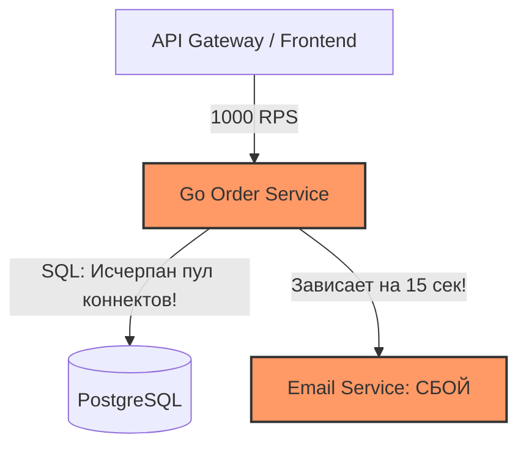
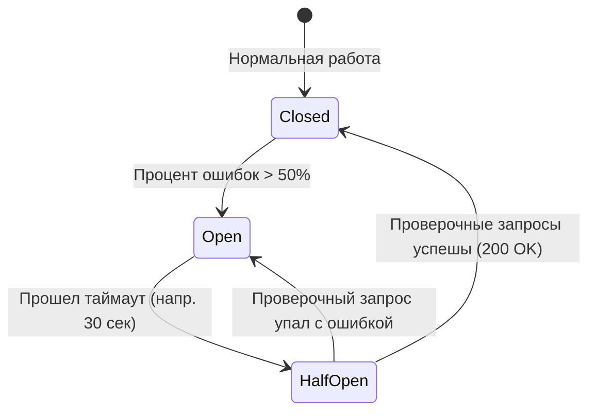

# Защита микросервисов от каскадных сбоев: Circuit Breaker, Retry с Exponential Backoff и Jitter

В распределенной микросервисной архитектуре сбой одного внешнего API (платежного шлюза, сервиса рекомендаций или базы данных) способен за несколько секунд уничтожить всю систему. Этот феномен называется **каскадным сбоем (Cascading Failure)**.

В этой статье мы подробно разберем механику каскадных обрушений, почему обычные циклы повторов (`Retry Storm`) действуют как DDoS-атака на ваши собственные серверы, и реализуем на Go паттерны защиты: **Circuit Breaker (Предохранитель)** и **Retry с Exponential Backoff & Jitter**.

---

## 1. Анатомия каскадного сбоя

Представьте, что ваш сервис оформления заказов (`Order Service` на Go) при каждой покупке делает синхронный HTTP/gRPC запрос в сервис рассылки (`Email Service`). 

В обычное время `Email Service` отвечает за `30 мс`. Но внезапно на почтовом сервере начались проблемы с сетью, и он начал отвечать с задержкой в `15 секунд` (или дожидаться таймаута).

### Что происходит в Go-сервисе:
1. Каждая входящая покупка спавнит горутину, которая делает запрос в `Email Service` и **зависает на 15 секунд**.
2. При нагрузке в 1 000 заказов в секунду через 10 секунд в вашем сервисе скопится **10 000 зависших горутин**.
3. Каждая зависшая горутина удерживает в памяти контекст, HTTP-запрос, открытый TCP-сокет и соединение с пула PostgreSQL (`db.Conn`).
4. Пул соединений PostgreSQL полностью исчерпывается, память сервера заканчивается (`OOM`), и `Order Service` падает с ошибкой `500 Internal Server Error`.
5. Теперь падают все frontend-приложения и API Gateway, которые обращались к `Order Service`. Система сложилась как карточный домик из-за некритичной отправки писем!



---

## 2. Паттерн Circuit Breaker (Предохранитель)

Чтобы предотвратить зависание горутин и дать упавшему сервису время на восстановление, между сервисами ставится **Circuit Breaker (Автоматический выключатель)**.

Паттерн работает точно так же, как электрическая пробка в квартире: если напряжение прыгает (процент ошибок зашкаливает), пробка **«выбивается»** и размыкает цепь, прекращая прохождение тока.

### Три состояния Circuit Breaker:



1. **Closed (Закрыт — всё работает):** Запросы свободно проходят во внешнюю систему. Предохранитель считает количество успехов и ошибок.
2. **Open (Открыт — авария!):** Если доля ошибок (или таймаутов) за последние 10 секунд превысила порог (например, 50%), предохранитель **размыкается**. Все последующие вызовы из Go мгновенно отклоняются с ошибкой `ErrCircuitOpen` **за 0 миллисекунд без сетевого запроса и ожидания 15 секунд**.
3. **Half-Open (Полуоткрыт — разведка):** Через фиксированное время (например, 30 секунд) предохранитель переходит в режим тестирования и пропускает **один или два** тестовых запроса во внешнюю систему. Если они завершились успехом — цепь замыкается (`Closed`). Если упали — цепь снова размыкается (`Open`) еще на 30 секунд.

### Реализация на Go (`sony/gobreaker`):

```go
package resiliency

import (
	"context"
	"errors"
	"fmt"
	"io"
	"net/http"
	"time"

	"github.com/sony/gobreaker"
)

type ExternalClient struct {
	httpClient *http.Client
	cb         *gobreaker.CircuitBreaker
}

func NewExternalClient() *ExternalClient {
	settings := gobreaker.Settings{
		Name:        "EmailServiceCB",
		MaxRequests: 3,                // В состоянии Half-Open пропускаем максимум 3 тестовых запроса
		Interval:    10 * time.Second, // Период сбора статистики в состоянии Closed
		Timeout:     30 * time.Second, // Сколько времени цепь остается в состоянии Open до перехода в Half-Open
		ReadyToTrip: func(counts gobreaker.Counts) bool {
			// Выбиваем пробку, если было сделано минимум 10 запросов и доля ошибок > 50%
			failureRatio := float64(counts.TotalFailures) / float64(counts.Requests)
			return counts.Requests >= 10 && failureRatio >= 0.5
		},
		OnStateChange: func(name string, from gobreaker.State, to gobreaker.State) {
			fmt.Printf("[ALARM] Circuit Breaker '%s' изменил состояние: %s -> %s\n", name, from, to)
		},
	}

	return &ExternalClient{
		httpClient: &http.Client{Timeout: 3 * time.Second},
		cb:         gobreaker.NewCircuitBreaker(settings),
	}
}

func (c *ExternalClient) SendEmail(ctx context.Context, email string) error {
	// Оборачиваем сетевой вызов в метод cb.Execute()
	_, err := c.cb.Execute(func() (interface{}, error) {
		req, err := http.NewRequestWithContext(ctx, http.MethodPost, "http://email-service/send", nil)
		if err != nil {
			return nil, err
		}

		resp, err := c.httpClient.Do(req)
		if err != nil {
			return nil, err // Сетевая ошибка или таймаут -> Circuit Breaker засчитает Failure
		}
		defer resp.Body.Close()

		if resp.StatusCode >= 500 {
			return nil, fmt.Errorf("server error: %d", resp.StatusCode) // 5xx -> тоже Failure
		}

		io.Copy(io.Discard, resp.Body)
		return nil, nil // 2xx/4xx -> Success
	})

	if errors.Is(err, gobreaker.ErrOpenState) {
		// Предохранитель выбит! Возвращаем fallback или откладываем задачу в очередь
		return errors.New("email service temporarily disabled by circuit breaker (fallback triggered)")
	}

	return err
}
```

---

## 3. Почему наивный Retry превращается в DDoS-атаку (Retry Storm)

Часто разработчики пытаются обработать сетевые ошибки простым циклом повторов:

```go
// ОПАСНЫЙ АНТИПАТТЕРН: Наивный Retry
for i := 0; i < 3; i++ {
    err := callExternalAPI()
    if err == nil {
        break
    }
    time.Sleep(1 * time.Second)
}
```

### Почему это убивает продакшен?
Представьте, что база данных или внешний API перезагрузился на 5 секунд. 
В этот момент 10 000 клиентов получают ошибку. Если каждый клиент немедленно (или ровно через 1 секунду) сделает 3 повторные попытки, на только что поднимающийся сервер обрушится **30 000 одновременных запросов в одну секунду**!

Сервер мгновенно падает от перегрузки (самосинхронизованный шторм повторов — **Retry Storm**). Вместо спасения мы устроили собственному сервису мощную DDoS-атаку.

---

## 4. Экспоненциальная задержка с шумом: Exponential Backoff + Jitter

Чтобы повторные попытки были безопасными, они должны подчиняться двум правилам:
1. **Exponential Backoff (Экспоненциальная задержка):** С каждой неудачной попыткой время ожидания удваивается ($2^0=1\text{с}, 2^1=2\text{с}, 2^2=4\text{с}, 8\text{с}, 16\text{с}$). Это дает внешней системе «глубокий вдох» для восстановления.
2. **Jitter (Случайный шум):** Если тысячи горутин начали делать запросы в одно время, их экспоненциальные задержки будут совпадать (все придут ровно через 2 секунды, затем ровно через 4). Чтобы **размазать пик нагрузки по времени**, к задержке добавляется случайный интервал (например, $\pm 50\%$ случайного шума).

```
Без Jitter:  [1000 запросов] ──(2 сек)──> [1000 запросов] ──(4 сек)──> [1000 запросов] (Пики!)
С Jitter:    [.. 300 .. 400 .. 300 ..] ─(Размазано по времени от 1 до 3 сек)─> Равномерная нагрузка!
```

### Реализация правильного алгоритма Backoff + Full Jitter на Go:

```go
package resiliency

import (
	"context"
	"crypto/rand"
	"errors"
	"fmt"
	"math"
	"math/big"
	"time"
)

type RetryConfig struct {
	MaxRetries int
	BaseDelay  time.Duration
	MaxDelay   time.Duration
}

// DoWithRetry выполняет функцию с экспоненциальной задержкой и Full Jitter
func DoWithRetry(ctx context.Context, cfg RetryConfig, fn func() error) error {
	var err error

	for attempt := 0; attempt <= cfg.MaxRetries; attempt++ {
		err = fn()
		if err == nil {
			return nil // Успех!
		}

		// Если попытки закончились — возвращаем последнюю ошибку
		if attempt == cfg.MaxRetries {
			break
		}

		// Проверяем, не отменил ли вызывающий код контекст (например, клиент закрыл вкладку браузера)
		if ctx.Err() != nil {
			return ctx.Err()
		}

		// 1. Вычисляем чистый экспоненциальный Backoff: BaseDelay * 2^attempt
		temp := float64(cfg.BaseDelay) * math.Pow(2, float64(attempt))
		backoff := time.Duration(temp)
		if backoff > cfg.MaxDelay {
			backoff = cfg.MaxDelay
		}

		// 2. Вычисляем Full Jitter: случайное число от 0 до backoff
		jitteredDelay := fullJitter(backoff)

		fmt.Printf("[RETRY] Попытка %d упала с ошибкой: %v. Ждем %v перед повтором...\n", attempt+1, err, jitteredDelay)

		select {
		case <-time.After(jitteredDelay):
			continue
		case <-ctx.Done():
			return ctx.Err()
		}
	}

	return fmt.Errorf("operation failed after %d retries: %w", cfg.MaxRetries, err)
}

// fullJitter возвращает случайную длительность в диапазоне [0, maxDelay)
func fullJitter(maxDelay time.Duration) time.Duration {
	if maxDelay <= 0 {
		return 0
	}
	n, _ := rand.Int(rand.Reader, big.NewInt(int64(maxDelay)))
	return time.Duration(n.Int64())
}
```

---

## 5. Вопросы с собеседований (FAQ)

###  «В каких случаях Retry категорически запрещен?»
**Ответ:**
Повторно выполнять запрос (`Retry`) категорически запрещено для **неидемпотентных операций изменяющего характера** (например, списание денег `POST /charge` без токена `Idempotency-Key` или создание заказа), если предыдущая ошибка была сетевой (`timeout / connection reset`). При таймауте мы не знаем: успел ли удаленный сервер обработать наш запрос перед обрывом связи. Если сделать повтор без идемпотентности, деньги спишутся дважды. 
Также запрещено делать Retry при получении клиентских ошибок **`HTTP 4xx` (`400 Bad Request`, `401 Unauthorized`, `403 Forbidden`)**, так как они указывают на ошибку в аргументах и при повторе гарантированно вернут ту же ошибку.

---

###  «Чем отличается `Circuit Breaker` от `Rate Limiter`?»
**Ответ:**
* **Rate Limiter (Ограничитель скорости):** Защищает **наш собственный сервер** от входящего перегруза со стороны клиентов (например, разрешает одному IP-адресу делать не более 100 запросов в минуту, отсекая лишнее с `HTTP 429`).
* **Circuit Breaker (Предохранитель):** Защищает **наш сервис и внешнюю систему** при исходящих вызовах от зависаний и каскадных сбоев, если удаленная система деградировала или упала.

---

###  «Что должно происходить с запросом в Go-сервисе, когда Circuit Breaker переходит в состояние `Open`?»
**Ответ:**
Крайне важно не просто выбрасывать `ErrCircuitOpen`, а предусмотреть **Graceful Degradation (Элегантную деградацию / Fallback)**:
1. **Возврат значения по умолчанию:** Если упал сервис персональных рекомендаций на главной странице, вместо ошибки 500 мы возвращаем закешированный список «Товары дня».
2. **Асинхронное откладывание:** Если упал сервис аналитики или рассылки писем, событие сохраняется в локальную очередь (`Kafka/RabbitMQ` или `DLQ`), и воркер отправит его позже, когда предохранитель вернется в `Closed`.
