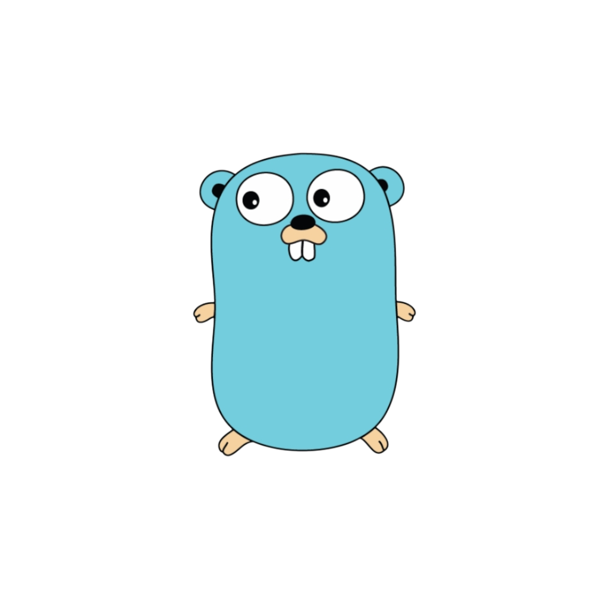

# Что то про GoLang

</img>

Go (Golang) представляет компилируемый статически типизированный язык программирования от компании Google. Язык Go предназначен для создания различного рода приложений, но прежде всего это веб-сервисы и клиент-серверные приложения.

Основные особенности языка Go:
*  Компилируемый: Golang создан как компилируемый язык, что означает, что программы go компилируются через компилятор, который преобразует исходный код в бинарный код. Операционная система выполняет этот машинный код без использования какого-либо движка времени выполнения. Это ускоряет выполнение Golang по сравнению с другими языками.

* Автоматическая сборка мусора: с этой функцией программисту не нужно беспокоиться о том, как будет управляться память. В настоящее время в Go используется сборщик мусора mark-and-sweep. Он отслеживает созданные объекты и обрабатывает сборку мусора одновременно с запущенными процессами, управляемыми встроенным пакетом исполнителя Go в каждом приложении.

* Параллелизм: запуск более чем одной задачи одновременно называется параллелизмом. Golang предоставляет другой подход к выполнению нескольких функций одновременно. Это возможно с помощью горутин и каналов. Горутины можно считать функциями, выполняемыми одновременно с другими функциями. С другой стороны, канал обеспечивает функциональность связи между несколькими горутинами.

* Поддержка многоядерности: как указано выше, в Golang есть функция параллелизма, и эти горутины используют несколько ядер процессора для выполнения. Теперь вопрос в том, сколько процессоров будут использоваться горутинами для выполнения параллелизма. В Golang есть переменная времени выполнения «GOMAXPROCS», которая управляет количеством процессоров, которые будут выполняться одновременно. По умолчанию значение этого параметра равно количеству ядер процессора, определенных на оборудовании. Разработчик имеет возможность изменять его значение по мере необходимости для повышения производительности.

* Generics (обобщения): Go представил generics в версии 1.18, что является ничем иным, как типом, который может использоваться совместно с другими типами данных. До generics совместное использование нескольких типов было возможно с помощью интерфейсов или io.Reader, но это было немного сложно. Generics помогают выполнять различные поведения отдельных переменных с различными типами данных.

* Простота тестирования: язык Go предлагает богатую библиотеку, которая поддерживает автоматическое тестирование. Так, специальный пакет "testing" позволяет запустить команду go test для тестирования кода, что покрывает большинство сценариев тестирования. Для оценки производительности существуют различые бенчмарки, например, бенчмарки функций и памяти.

* Стандартная библиотека:: Важной частью хорошего программирования является возможность повторного использования кода. Стандартная библиотека языка Go содержит множество пакетов, которые обеспечивают отличную функциональность для приложений Go.

 

🔗 Связаться со мной:

  

