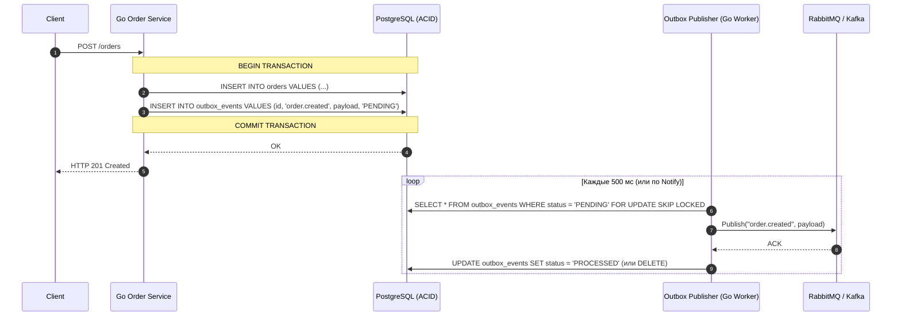

# Двойная запись (Dual Write): Transactional Outbox vs Change Data Capture (CDC)

При разработке распределенных систем на Go разработчики постоянно сталкиваются с проблемой **двойной записи (Dual Write Problem)**: когда один микросервис должен одновременно изменить состояние в реляционной базе данных (например, создать заказ в PostgreSQL) и отправить асинхронное событие в брокер сообщений (`order.created` в RabbitMQ/Kafka).

В этой статье мы разберем, почему наивная отправка приводит к рассинхронизации данных, почему двухфазный коммит (**2PC**) не подходит для микросервисов, и детально реализуем два главных архитектурных стандарта индустрии: **Transactional Outbox с `SKIP LOCKED`** на Go и **Change Data Capture (CDC) через Debezium**.

---

## 1. Анатомия проблемы Dual Write

Представьте классический код создания заказа в Go-сервисе:

```go
func (s *OrderService) CreateOrder(ctx context.Context, order *Order) error {
    // 1. Сохраняем заказ в PostgreSQL
    if err := s.db.SaveOrder(ctx, order); err != nil {
        return err
    }

    // 2. Отправляем событие в RabbitMQ/Kafka для сервисов уведомлений и склада
    event := NewOrderCreatedEvent(order)
    if err := s.broker.Publish(ctx, "order.created", event); err != nil {
        return err // Поздно! Заказ в БД уже сохранен!
    }

    return nil
}
```

### Что может пойти не так?
1. **Сбой после записи в БД:** Сервис успешно выполнил `SaveOrder()`, но ровно перед вызовом `Publish()` мигнула сеть, упал сам брокер сообщений или сервер Go был убит `OOM Killer` по `SIGKILL`. В результате заказ существует в базе данных, но склад и служба доставки **никогда не узнают о нем**. Произошел критический рассинхрон.
2. **Обратная последовательность (Сначала брокер, потом БД):** Если сначала отправить сообщение в Kafka, а потом попытаться сделать `SaveOrder()`, база данных может выбросить ошибку (нарушение `UNIQUE KEY` или сбой диска). В итоге брокер уже разослал всем событие, склад списал товар, а заказа в базе реальности не существует.
3. **Почему не работает 2PC (Two-Phase Commit):** Попытка объединить PostgreSQL и Kafka в одну распределенную транзакцию через протокол `XA / 2PC` крайне уязвима. Протокол требует блокировки ресурсов на обеих сторонах во время фазы подготовки. Если координатор или одна из систем зависнет, блокировки на таблицах БД останутся висеть бесконечно, снижая пропускную способность системы в десятки раз.

---

## 2. Паттерн Transactional Outbox

Чтобы гарантировать атомарность без распределенных транзакций, мы используем локальные ACID-транзакции самой реляционной базы данных.

**Идея:** Вместо отправки сообщения напрямую в брокер по сети, мы создаем в PostgreSQL специальную таблицу **`outbox_events`**. В рамках **одной и той же SQL-транзакции** мы сохраняем и бизнес-сущность (`orders`), и событие для отправки (`outbox_events`).
Если транзакция коммитится — обе записи гарантированно на диске. Если сбоит — обе откатываются.



### Схема таблицы `outbox_events`:

```sql
CREATE TABLE outbox_events (
    id          UUID PRIMARY KEY DEFAULT gen_random_uuid(),
    aggregate_type VARCHAR(255) NOT NULL, -- например, 'order'
    aggregate_id   VARCHAR(255) NOT NULL, -- ID заказа
    event_type     VARCHAR(255) NOT NULL, -- например, 'order.created'
    payload        JSONB NOT NULL,        -- тело сообщения
    status         VARCHAR(50) DEFAULT 'PENDING', -- PENDING, PROCESSED, FAILED
    retry_count    INT DEFAULT 0,
    created_at     TIMESTAMPTZ DEFAULT CURRENT_TIMESTAMP,
    processed_at   TIMESTAMPTZ
);

-- Индекс для быстрой выборки необработанных событий
CREATE INDEX idx_outbox_pending ON outbox_events (created_at) WHERE status = 'PENDING';
```

---

## 3. Магия `SELECT ... FOR UPDATE SKIP LOCKED` на Go

Когда в вашем Kubernetes-кластере работает **10 реплик** воркера, разбирающего таблицу `outbox_events`, наивный `SELECT * FROM outbox_events WHERE status = 'PENDING' LIMIT 100` приведет к жесткому состоянию гонки: все 10 реплик выберут одни и те же 100 строк и отправят в брокер 10-кратные дубликаты.

Чтобы безопасно распараллелить выборку без взаимоблокировок (`Deadlocks`), PostgreSQL начиная с версии 9.5 поддерживает конструкцию **`FOR UPDATE SKIP LOCKED`**:

1. `FOR UPDATE` блокирует выбранные строки от изменения другими транзакциями.
2. `SKIP LOCKED` говорит базе данных: *«Если строка уже заблокирована соседним воркером, не жди ее освобождения, а молча пропусти и возьми следующую свободную строку»*.

### Реализация Outbox Publisher на Go (`pgxpool`):

```go
package outbox

import (
	"context"
	"database/sql"
	"encoding/json"
	"fmt"
	"log"
	"time"

	"github.com/google/uuid"
	"github.com/jackc/pgx/v5"
	"github.com/jackc/pgx/v5/pgxpool"
)

type OutboxEvent struct {
	ID        uuid.UUID
	EventType string
	Payload   json.RawMessage
}

type MessageBroker interface {
	Publish(ctx context.Context, topic string, payload []byte) error
}

type OutboxWorker struct {
	pool   *pgxpool.Pool
	broker MessageBroker
}

// ProcessBatch выбирает пачку сообщений с блокировкой SKIP LOCKED и публикует их
func (w *OutboxWorker) ProcessBatch(ctx context.Context, batchSize int) error {
	// 1. Открываем транзакцию для выборки и блокировки строк
	tx, err := w.pool.Begin(ctx)
	if err != nil {
		return fmt.Errorf("begin tx failed: %w", err)
	}
	defer func() { _ = tx.Rollback(ctx) }()

	// 2. Выбираем события с магией SKIP LOCKED
	// Никакая другая горутина или под не получит эти же строки до конца нашей транзакции!
	query := `
		SELECT id, event_type, payload 
		FROM outbox_events 
		WHERE status = 'PENDING' 
		ORDER BY created_at ASC 
		LIMIT $1 
		FOR UPDATE SKIP LOCKED`

	rows, err := tx.Query(ctx, query, batchSize)
	if err != nil {
		return fmt.Errorf("query outbox failed: %w", err)
	}

	var events []OutboxEvent
	for rows.Next() {
		var ev OutboxEvent
		if err := rows.Scan(&ev.ID, &ev.EventType, &ev.Payload); err != nil {
			return err
		}
		events = append(events, ev)
	}
	rows.Close()

	if len(events) == 0 {
		return nil // Нет новых событий
	}

	// 3. Отправляем события в брокер
	var processedIDs []uuid.UUID
	for _, ev := range events {
		err := w.broker.Publish(ctx, ev.EventType, ev.Payload)
		if err != nil {
			log.Printf("[WARN] Ошибка публикации события %s: %v. Будет повторено в следующем цикле", ev.ID, err)
			continue // Не добавляем в список успешно обработанных
		}
		processedIDs = append(processedIDs, ev.ID)
	}

	// 4. Помечаем успешно отправленные события как PROCESSED (или удаляем их)
	if len(processedIDs) > 0 {
		updateQuery := `UPDATE outbox_events SET status = 'PROCESSED', processed_at = NOW() WHERE id = ANY($1)`
		_, err := tx.Exec(ctx, updateQuery, processedIDs)
		if err != nil {
			return fmt.Errorf("update status failed: %w", err)
		}
	}

	// 5. Коммитим транзакцию (освобождаем строки)
	return tx.Commit(ctx)
}

// Start запускает бесконечный цикл полинга
func (w *OutboxWorker) Start(ctx context.Context, pollInterval time.Duration) {
	ticker := time.NewTicker(pollInterval)
	defer ticker.Stop()

	for {
		select {
		case <-ctx.Done():
			return
		case <-ticker.C:
			if err := w.ProcessBatch(ctx, 100); err != nil {
				log.Printf("[ERROR] Outbox batch error: %v", err)
			}
		}
	}
}
```

---

## 4. Альтернатива без полинга: Change Data Capture (CDC / Debezium)

Полинг таблицы `outbox_events` (даже раз в 100 мс) создает постоянную фоновую нагрузку на PostgreSQL при пустой таблице и добавляет небольшую задержку (Latency) перед отправкой.

Более продвинутым и высоконагруженным подходом является **Change Data Capture (CDC)** с использованием **Debezium**.

### Как работает Debezium (Log-Based CDC)?
Вместо того чтобы наш Go-сервис опрашивал таблицу через `SELECT ... FOR UPDATE`, Debezium притворяется **репликой PostgreSQL**.

1. При коммите любой транзакции PostgreSQL записывает изменения на жесткий диск в бинарный журнал предзаписи — **WAL (Write-Ahead Log)**.
2. Debezium подключается к слоту логической репликации (`Logical Replication Slot`) PostgreSQL.
3. База данных сама мгновенно стримит в Debezium поток изменений в реальном времени.
4. Debezium читает записи WAL, парсит изменения в таблице `outbox_events` (или напрямую в `orders`) и автоматически публикует их в топики Apache Kafka.

> [!NOTE]
> **Преимущества CDC:**
> * **Нулевая нагрузка на CPU базы данных:** Нет постоянных тяжелых `SELECT` запросов. Чтение идет из последовательного потока WAL.
> * **Нулевой код отправки в Go:** Вашему Go-сервису больше вообще не нужен код воркера-паблишера! Вы просто делаете `INSERT INTO outbox_events` внутри SQL-транзакции, и на этом работа сервиса закончена. Debezium доставит событие в брокер автоматически.

---

## 5. Вопросы с собеседований (FAQ)

###  «Что делать с таблицей `outbox_events` со временем? Она же разрастется до миллиардов строк!»
**Ответ:**
Есть два стандартных подхода:
1. **Мгновенное удаление после отправки (`DELETE` вместо `UPDATE status = 'PROCESSED'`):** Если нам не нужен исторический аудит отправок, воркер в своей транзакции после успешного `ACK` от брокера сразу вызывает `DELETE FROM outbox_events WHERE id = ANY(...)`. Таблица всегда остается маленькой (содержит только текущую очередь).
2. **Партиционирование по датам + Cron Archiver:** Если логи отправок нужны для дебага, таблица `outbox_events` партиционируется по дням (`PARTITION BY RANGE (created_at)`). Отдельная ночная джоба просто делает `DROP PARTITION` для партиций старше 7 или 30 дней. Это мгновенная и бесплатная операция для БД, не блокирующая autovacuum.

---

###  «Паттерн Transactional Outbox гарантирует доставку `Exactly-Once` или `At-Least-Once`? Могут ли быть дубликаты?»
**Ответ:**
Outbox гарантирует строго **`At-Least-Once` (доставка хотя бы один раз)**. 
Дубликаты возможны в следующей ситуации:
1. Воркер успешно прочитал строку из `outbox_events` и отправил сообщение в RabbitMQ.
2. RabbitMQ сохранил сообщение и послал воркеру `ACK`.
3. Воркер попытался выполнить `UPDATE outbox_events SET status = 'PROCESSED'`, но в этот момент произошло отключение питания или сбой сети с PostgreSQL.
4. Транзакция воркера откатилась. Строка в `outbox_events` осталась в статусе `PENDING`.
5. При следующем цикле воркер снова возьмет эту строку и отправит сообщение повторно.

**Следствие:** Все сервисы-потребители (Consumers), читающие сообщения из брокера, **обязаны быть идемпотентными** (сохранять `message_id` / `event_id` и игнорировать повторные обработки).

---

###  «Почему в Go при использовании `pgxpool` важно закрывать `rows.Close()` и проверять `rows.Err()` при работе со `SKIP LOCKED`?»
**Ответ:**
В Go соединение из пула привязывается к активному объекту `rows`. Если не вызвать `rows.Close()` или выйти из цикла раньше времени при панике, соединение не вернется в пул (`pgxpool`) и останется висеть в состоянии `BUSY`. Так как мы используем транзакцию `BEGIN ... COMMIT`, незакрытые `rows` удержат блокировку строк в таблице `outbox_events`, и другие воркеры через `SKIP LOCKED` не смогут забрать эти события, что приведет к остановке обработки очереди.
